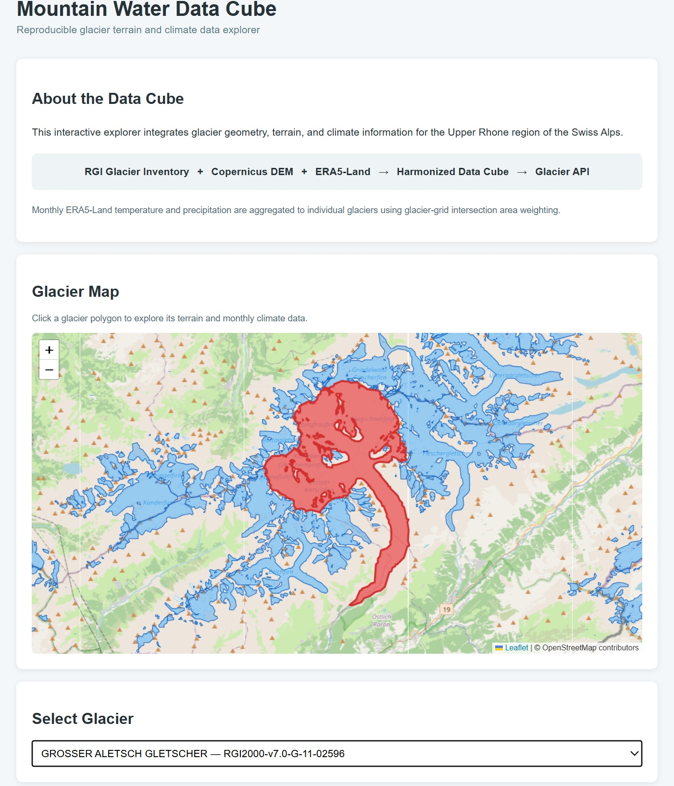
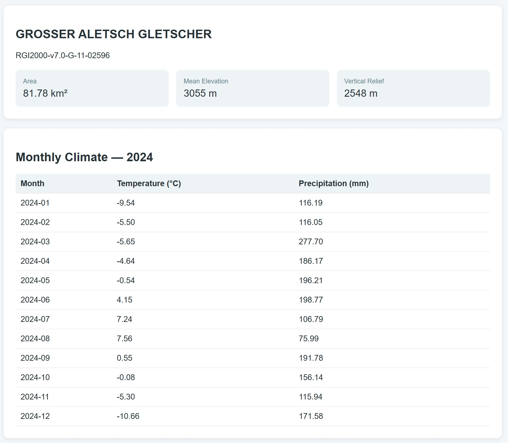

# Mountain Water Data Cube

A reproducible geospatial data pipeline and interactive explorer for integrating glacier geometry, terrain, and climate data in the Swiss Alps.

**Created by Roya Habibi**

## Overview

Mountain Water Data Cube demonstrates an end-to-end workflow for acquiring, harmonizing, analyzing, and serving heterogeneous cryosphere and mountain-environment datasets.

The project integrates:

- **Randolph Glacier Inventory (RGI v7)** glacier geometries
- **Copernicus DEM GLO-30** terrain data
- **ERA5-Land** temperature and precipitation data

The workflow integrates vector GeoJSON, raster GeoTIFF/Cloud Optimized GeoTIFF (COG), and multidimensional Zarr data within a single reproducible processing pipeline.

The source datasets differ substantially in data model, spatial resolution, temporal structure, and access mechanism. The pipeline brings them into a reproducible workflow, constructs analysis-ready multidimensional datasets using Xarray and Zarr, derives glacier-level terrain and climate information, and exposes the results through a REST API and an interactive web interface.

The current implementation focuses on the Upper Rhône region of the Swiss Alps.

---
## Interactive Glacier Explorer

The interactive explorer provides map-based glacier selection and links glacier geometry to terrain and climate information.

<p align="center">
  
</p>
---
## Workflow

```text
RGI Glacier Inventory
        │
        ├──────────────┐
        │              │
        ▼              ▼
Glacier geometry   Copernicus DEM
        │              │
        └──────┬───────┘
               ▼
     Glacier terrain analysis
               │
               │
ERA5-Land ─────┤
Temperature    │
Precipitation  │
               ▼
      Xarray / Zarr climate cube
               │
               ▼
 Glacier-grid spatial intersections
               │
               ▼
 Area-weighted glacier climate
               │
        ┌──────┴──────┐
        ▼             ▼
    FastAPI       Visualization
        │
        ▼
 Interactive Leaflet explorer
```

The workflow is designed so that raw source data, intermediate processing, derived products, validation, and data-access components remain clearly separated and reproducible.

---

## Study Area

The project uses an Upper Rhône / Swiss Alps study region:

```text
Longitude: 7.5°E – 8.5°E
Latitude:  46.0°N – 46.7°N
```

Glaciers are selected by spatial intersection with this study extent. Their complete RGI geometries are retained rather than clipped at the study-area boundary.

This results in **834 glacier polygons** for the current implementation.

A one-cell ERA5-Land buffer is used during climate extraction so that complete selected glacier geometries remain covered by the climate grid.

---

## Data Sources

### Randolph Glacier Inventory (RGI v7)

RGI glacier polygons are retrieved programmatically from the GLIMS geospatial service.

The glacier data provide standardized glacier geometry and attributes including area, elevation, slope, aspect, and glacier identifiers.

### Copernicus DEM GLO-30

Copernicus DEM GLO-30 tiles are discovered programmatically and accessed from the Copernicus Data Space Ecosystem.

Cloud Optimized GeoTIFFs (COGs) are accessed remotely and mosaicked for the study area using Rasterio.

The resulting DEM is used to derive glacier-level:

- minimum elevation
- maximum elevation
- mean elevation
- vertical relief

### Glacier-Level Terrain and Climate Data

For each selected glacier, the interface reports terrain attributes derived from the Copernicus DEM together with area-weighted monthly ERA5-Land temperature and precipitation.

<p align="center">
  
</p>

### Climate Time Series

The monthly glacier-level climate data are also presented as interactive temperature and precipitation time series.

<p align="center">
  
</p>

### ERA5-Land

ERA5-Land data are accessed from the ECMWF Analysis-Ready Cloud Optimized (ARCO) Zarr archive.

The current climate cube contains:

- 2 m air temperature
- total precipitation
- monthly temporal resolution
- year 2024
- 0.1° spatial resolution

Hourly ERA5-Land data are aggregated into monthly temperature means and monthly precipitation totals before integration with glacier geometries.

---

## Analysis-Ready Climate Cube

Monthly ERA5-Land temperature and precipitation are harmonized into an Xarray dataset and stored in Zarr format.

The climate cube has the conceptual structure:

```text
time × latitude × longitude
```

with climate variables:

```text
t2m    Monthly mean 2 m temperature
tp     Monthly total precipitation
```

This provides a compact multidimensional representation suitable for reproducible scientific analysis and downstream data integration.

---

## Glacier–Climate Integration

ERA5-Land has a substantially coarser spatial resolution than individual glacier geometries. Therefore, the project does not spatially downscale ERA5-Land to glacier-scale resolution.

Instead, a representative monthly climate value is derived for each glacier by area-weighting the ERA5-Land grid cells intersecting its polygon

For glacier \(g\) and climate variable \(X\):

\[
X_g(t) =
\frac{\sum_i A_{gi} X_i(t)}
     {\sum_i A_{gi}}
\]

where:

- \(A_{gi}\) is the area of intersection between glacier \(g\) and ERA5-Land grid cell \(i\)
- \(X_i(t)\) is the climate value of grid cell \(i\) at time \(t\)

This provides an area-weighted attribution of regional ERA5-Land climate information to each glacier while preserving the native climate-data resolution.

The integration produces:

**834 glaciers × 12 months = 10,008 glacier-month records**

with no missing temperature or precipitation values in the final dataset.

---

## Quality Assurance and Validation

Validation is incorporated at multiple stages of the pipeline rather than being treated as a separate final step.

### Glacier geometry

RGI-reported glacier areas were compared with areas independently calculated from glacier geometries in a metric CRS.

The mean discrepancy was approximately **0.00053 km²**, indicating close consistency between source attributes and processed geometries.

### DEM coverage

Of the 834 selected glaciers:

- **819** have full DEM coverage
- **15** have partial DEM coverage

Partial coverage occurs because complete glacier polygons are retained when they intersect the study-area selection boundary.

### DEM cross-product validation

For glaciers with full DEM coverage, glacier mean elevations derived from Copernicus DEM were compared with RGI elevation attributes:

| Metric | Result |
|---|---:|
| Bias | -2.17 m |
| MAE | 7.65 m |
| RMSE | 9.59 m |
| Pearson correlation | 0.9996 |

This comparison is used as a cross-product consistency check rather than as validation against ground-truth elevation measurements.

### Glacier-climate integration

The climate extraction extent provides full climate-grid coverage for all **834 glaciers**.

The glacier-grid overlay contains **968 glacier-grid intersections**.

Area weights are normalized independently for each glacier. The maximum absolute deviation of summed glacier weights from 1 is approximately:

```text
2.22 × 10⁻¹⁶
```

The final glacier-climate dataset contains exactly:

```text
834 × 12 = 10,008 records
```

with zero missing temperature and precipitation values.

---

## Exploratory Analysis

The project also demonstrates scientific analysis using the harmonized datasets.

Comparison of glacier area and Copernicus DEM-derived vertical relief shows a strong relationship after logarithmic transformation of glacier area:

```text
Pearson correlation (log10 area vs. relief):  0.8603
Spearman correlation:                         0.8895
R²:                                           0.7401
```

These analyses demonstrate how the harmonized pipeline can support glacier-scale exploratory research in addition to data engineering and delivery.

---

## REST API

A lightweight REST API is implemented with FastAPI.

Current endpoints include:

```text
GET /
GET /health
GET /glaciers
GET /glaciers/geojson
GET /glaciers/{rgi_id}
GET /glaciers/{rgi_id}/climate
GET /ui
```

The API provides glacier metadata, terrain statistics, glacier geometries, and monthly climate time series.

Interactive API documentation is automatically available through FastAPI's Swagger interface when the application is running.

---

## Interactive Glacier Explorer

The project includes a lightweight web interface built with Leaflet and Chart.js.

The explorer allows users to:

- browse glacier polygons on an interactive map
- identify glaciers spatially
- select glaciers directly from the map or from a dropdown list
- inspect glacier area, mean elevation, and vertical relief
- explore monthly temperature
- explore monthly precipitation
- view monthly climate values in tabular form

Map selection and dropdown selection are synchronized, providing linked spatial and statistical exploration of the processed dataset.

---

## Repository Structure

```text
mountain-water-data-cube/
│
├── api/
│   └── main.py
│
├── data/
│   ├── raw/
│   └── processed/
│
├── notebooks/
│
├── outputs/
│   ├── figures/
│   └── maps/
│
├── src/
│   ├── analysis.py
│   ├── build_climate_cube.py
│   ├── build_climate_grid.py
│   ├── build_glacier_climate_weights.py
│   ├── check_climate_outside_glaciers.py
│   ├── config.py
│   ├── datacube.py
│   ├── dem_access.py
│   ├── dem_discovery.py
│   ├── dem_pipeline.py
│   ├── download.py
│   ├── era5_access.py
│   ├── era5_precipitation.py
│   ├── era5_temperature.py
│   ├── explore_glaciers.py
│   ├── glacier_climate_integration.py
│   ├── glacier_dem_analysis.py
│   ├── plot_dem.py
│   ├── preprocess.py
│   ├── visualize.py
│   ├── visualize_glacier_climate.py
│   └── visualize_glacier_timeseries.py
│
├── ui/
│   ├── index.html
│   ├── style.css
│   └── app.js
│
├── .gitignore
├── README.md
└── requirements.txt
```

The `src/` modules separate data acquisition, preprocessing, DEM processing, ERA5-Land processing, data-cube construction, glacier-climate integration, quality assurance, analysis, and visualization.
---

## Technologies

The project uses:

**Geospatial data formats and processing**
- GeoJSON
- GeoTIFF / Cloud Optimized GeoTIFF (COG)
- GeoPandas
- Rasterio
- Shapely

**Multidimensional environmental data**
- Xarray
- Zarr

**Data analysis**
- NumPy
- Pandas
- SciPy

**Cloud and remote data access**
- S3-compatible object storage
- Cloud Optimized GeoTIFF
- ECMWF ARCO Zarr
- HTTP-based geospatial services

**Data access and visualization**
- FastAPI
- Leaflet
- Chart.js
- Matplotlib

**Reproducibility**
- Git
- Python virtual environments
- explicit dependency management

---

## Installation

Clone the repository and create a Python virtual environment.

On Windows PowerShell:

```powershell
py -3.12 -m venv .venv
Set-ExecutionPolicy -Scope Process -ExecutionPolicy Bypass
.\.venv\Scripts\Activate.ps1
pip install -r requirements.txt
```

---

## Running the API and Explorer

From the project root:

```powershell
uvicorn api.main:app --reload
```

The API is then available locally at:

```text
http://127.0.0.1:8000
```

Interactive API documentation:

```text
http://127.0.0.1:8000/docs
```

Interactive glacier explorer:

```text
http://127.0.0.1:8000/ui
```

---

## Reproducibility and Data Access

Large raw and processed datasets are intentionally excluded from version control. The repository contains the source code, configuration, and processing logic required to reproduce the workflow.

Reproducing the complete pipeline from the original data providers requires the corresponding data-access credentials:

- Copernicus DEM acquisition requires access to the Copernicus Data Space Ecosystem.
- ERA5-Land ARCO access requires the appropriate ECMWF/CDS credentials.

Authentication credentials are never stored in the repository.

When source-data access is unavailable, the processed datasets required to reproduce the downstream analysis, REST API, and interactive explorer can be provided separately.

---

## Current Scope and Limitations

This repository is a focused demonstration of a reproducible cryosphere geospatial data pipeline rather than a complete mountain hydrology model.

Current limitations include:

- climate analysis currently covers 2024
- ERA5-Land represents regional reanalysis climate at approximately 0.1° resolution and is not downscaled to individual glacier topography
- Copernicus DEM GLO-30 is a digital surface model rather than a bare-earth terrain model
- glaciers intersecting the study boundary retain their complete geometries, resulting in partial DEM coverage for a small subset
- the current application is designed as a lightweight scientific data explorer rather than a production-scale web service

These design choices keep the workflow transparent and reproducible while leaving clear paths for extension to longer climate periods, additional environmental variables, larger mountain regions, and more advanced modelling workflows.

---

## Project Status

The end-to-end prototype is operational and currently includes:

**data acquisition → geospatial preprocessing → DEM integration → multidimensional climate cube → glacier-climate spatial harmonization → QA/validation → REST API → interactive web explorer**

Further development can extend the temporal coverage, environmental variables, geographic domain, and scientific modelling components.